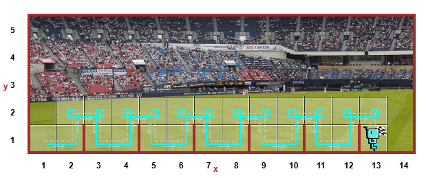
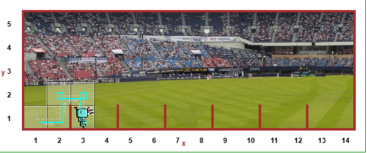
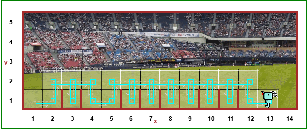
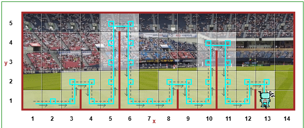
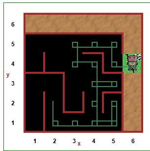

# Day 6: Python Functions and Karel

Welcome to Day 6 of my 100 Days of Code challenge! Today, I focused on defining my own functions and using `while` loops to solve logical puzzles.

## Concepts Learned
* Defining custom functions (`def`)
* Calling functions
* Python indentation rules
* Combining `while` loops with custom functions

## The Project: Reeborg's World
Today's challenge involved programming a virtual robot to overcome hurdles and reach a goal. The code in `reeborgs_world.py` contains the logic used to solve the puzzle on the [Reeborg's World platform](https://reeborg.ca/).

### Proof of Completion

## Files in this folder
* `practice.py`: Basic function definition practice.
* `reeborgs_world.py`: The logic used to navigate the robot.
